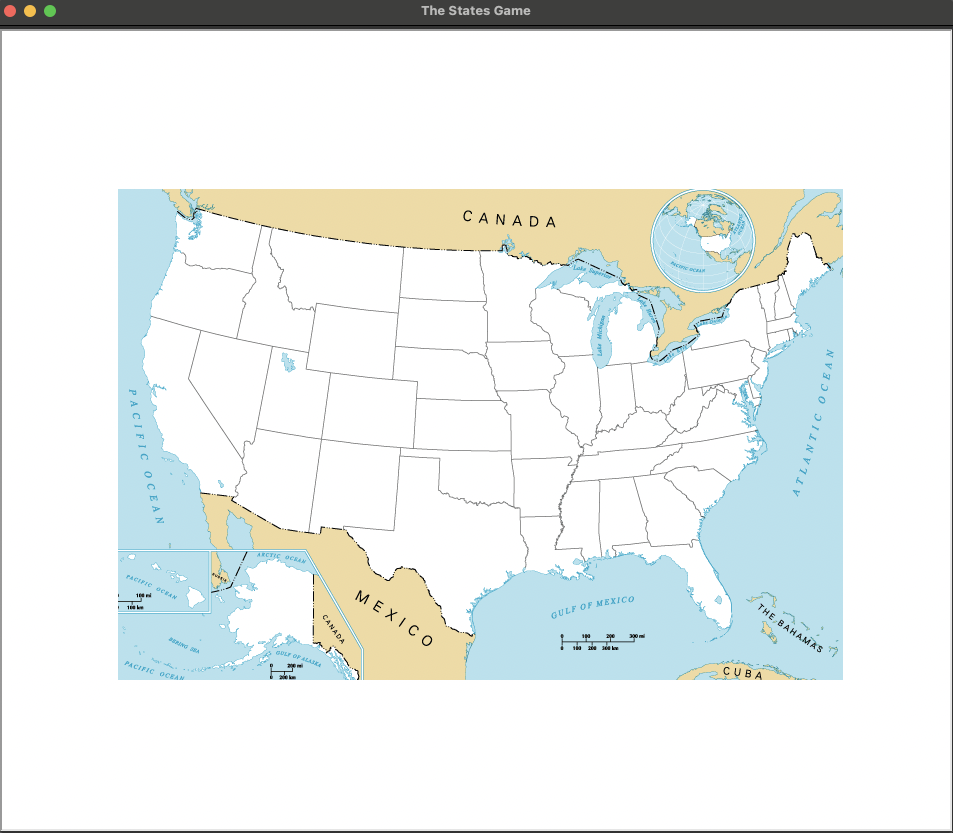
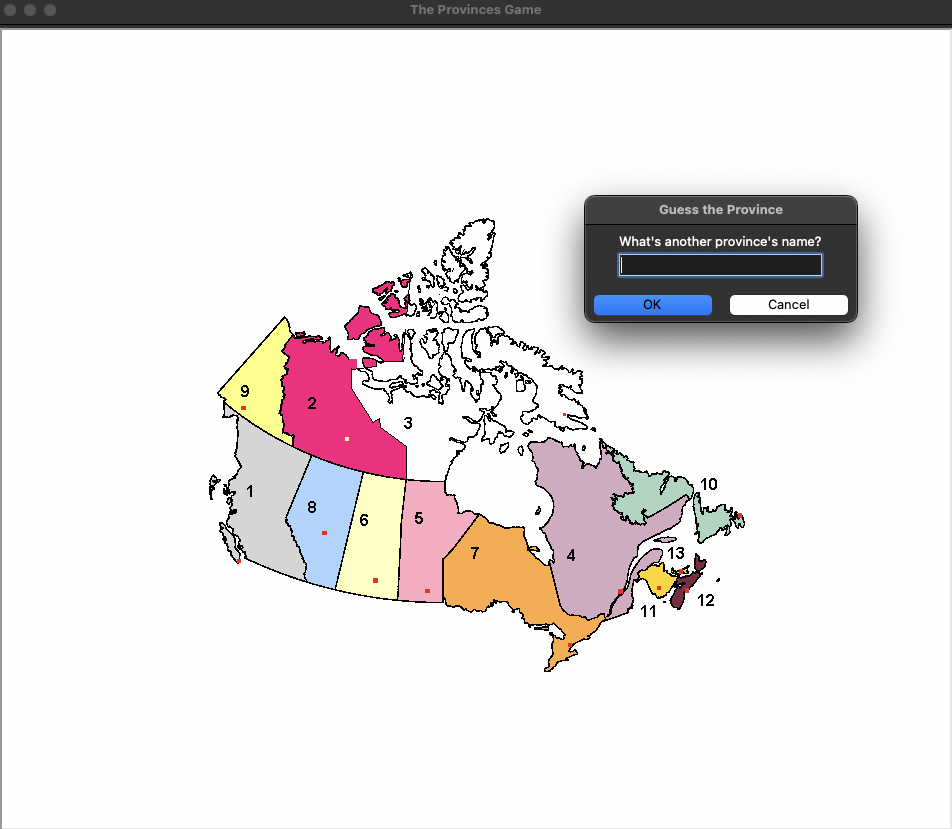

# StatesGame

## How to Play
- This is a game that allows you to guess the states in the United States of America or the provinces in Canada, as chosen in the main menu.
- The game will show you a map of the country, you have to guess the name of the state or province.
- If you guess correctly, the name of the state or province will be shown on the map.

